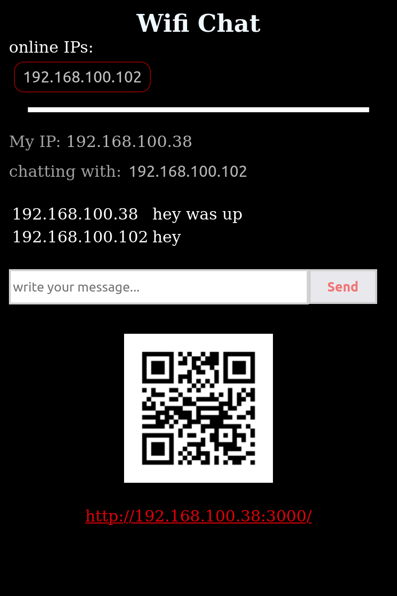

# WiFi-chat
A simple script allows users connected to same WLAN/WiFi to privatlly text-chat
run this command to install dependencies\n


## Installation 

run this command to install dependencies
```bash
npm install
```

Then run this command to run the script

```bash
npm start
```

## What it does?!

-it uses ip as user name
-checks for online devices (when server recieves any request from IP it counts as online)<br>
-when user selects an IP to chat with the server cehcks the messages between them<br>
-it saves online list and all messages inline database no SQLdb or file needed.<br>
-all online list and messages are removed when server restarts (ik thats not right xd).<br>
-it generates a QRcode for the website using  library<br>


### good luck
